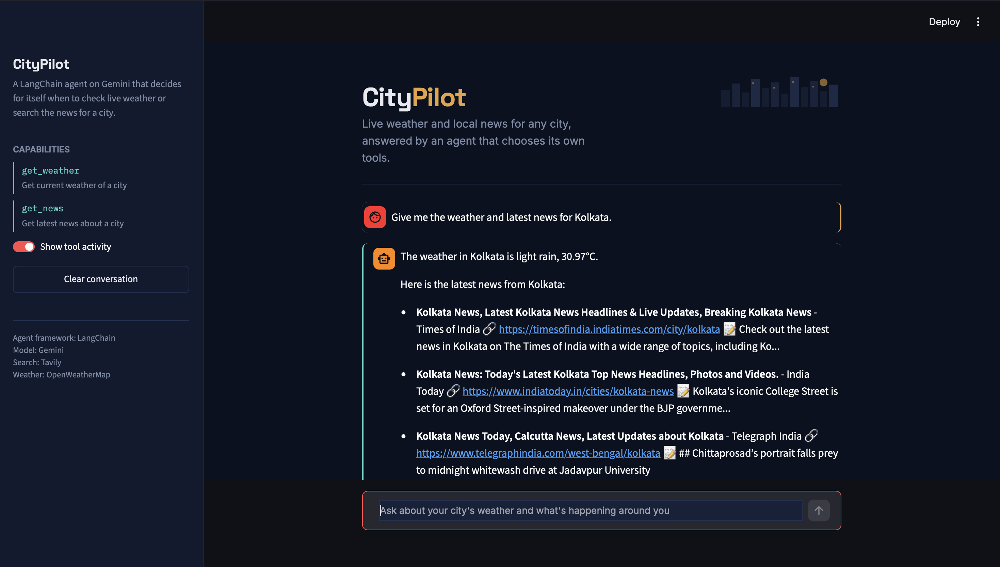
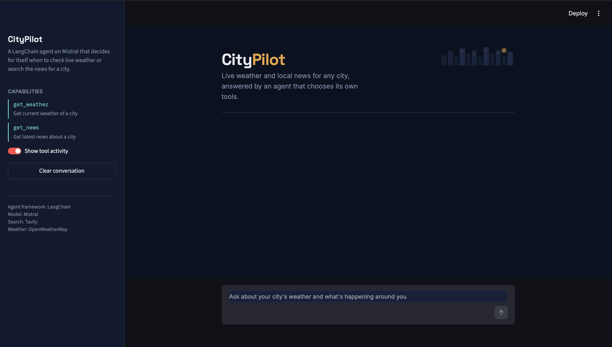

# 🏙️ CityPilot — AI Agent with Live Weather & News Tools

<p>
  
  
  
  
  
  
</p>

A tool-using AI agent built with **LangChain**, **Gemini**, and **Tavily**, wrapped in a clean **Streamlit** chat interface. Ask it about any city and it decides for itself which tool to call — live weather or the latest news — then answers in natural language.

---

## 📸 Preview

<table>
  <tr>
    <td width="50%">
      
      <p align="center"><sub>Live weather answer, with tool call shown transparently</sub></p>
    </td>
    <td width="50%">
      
      <p align="center"><sub>Home screen</sub></p>
    </td>
  </tr>
</table>

---

## ✨ Features

- **Tool-calling agent** — the LLM decides when to fetch weather vs. news, no hardcoded routing
- **Live weather** via the OpenWeatherMap API
- **Latest news** via Tavily web search
- **Transparent tool activity** — every tool call and its result is rendered in a telemetry-style panel, not hidden
- **Two run modes** — a terminal chatbot (`main.py`) with human-in-the-loop tool approval, and a web UI (`app.py`) for demos
- **Custom-designed UI** — a civic/skyline visual identity (navy, amber, teal) instead of a default chat template

## 🧱 Architecture

```
main.py         → agent definition: tools, LLM, system prompt, CLI loop
app.py          → Streamlit UI that imports and reuses the same agent/tools
```

## 🚀 Getting Started

### 1. Clone and install

```bash
git clone <your-repo-url>
cd citypilot
pip install -r requirements.txt
```

### 2. Add your API keys

Create a `.env` file in the project root:

```env
GOOGLE_API_KEY=your_gemini_key
OPENWEATHER_API_KEY=your_openweathermap_key
TAVILY_API_KEY=your_tavily_key
```

### 3. Run it

**Web UI (recommended for demos):**
```bash
streamlit run app.py
```

**Terminal chatbot (with tool-approval prompts):**
```bash
python main.py
```

## 🛠️ Tech Stack

| Layer            | Tool                            |
|-------------------|----------------------------------|
| LLM               | Google Gemini (`gemini-2.5-flash`) |
| Agent framework   | LangChain (`create_agent`)      |
| Weather data      | OpenWeatherMap API               |
| News search       | Tavily                           |
| UI                | Streamlit                        |

## 📌 Notes on design decisions

- The CLI version uses a blocking `input()`-based approval step before every tool call, as a simple demonstration of human-in-the-loop control.
- The web UI can't block on terminal input mid-request, so it takes a different approach: every tool call the agent makes is rendered in a monospace "telemetry" panel in the chat, so the reasoning stays transparent without a blocking prompt.

## 🔮 Possible extensions

- Swap the transparency panel for real approve/deny buttons using a LangGraph checkpointer + interrupt
- Add more tools (currency conversion, timezone lookup, events)
- Deploy on Streamlit Community Cloud for a live demo link

## 📄 License

MIT